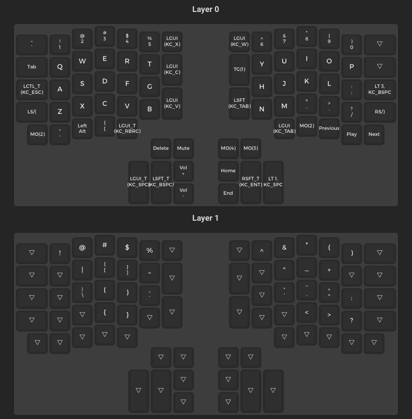
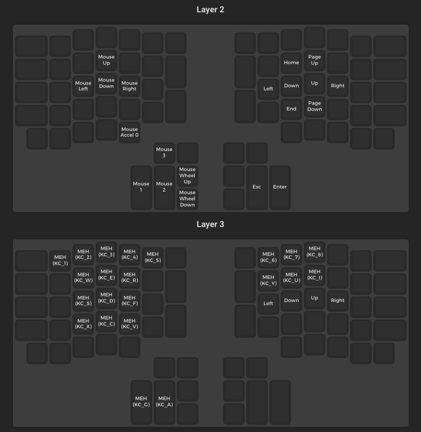
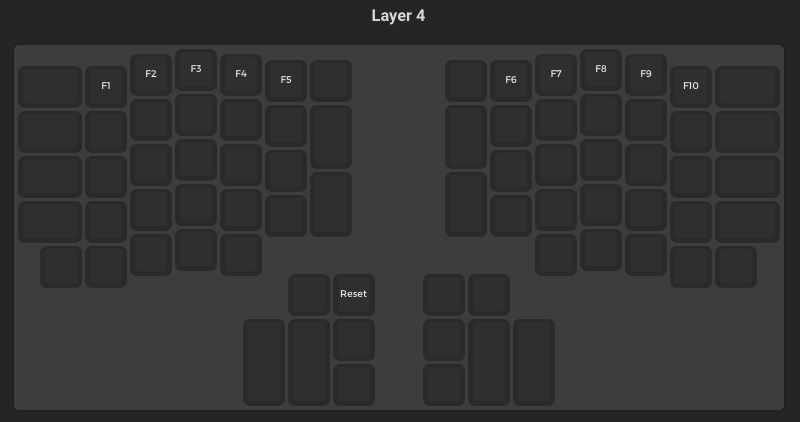

## QMK Configerator

1. Visit [QMK Configurator](https://config.qmk.fm/#/ergodox_ez/LAYOUT_ergodox_pretty) and upload the json file from the repo.
2. Reconfigure the keys.
3. Download the json file and move it to the repo.
4. Download the bin file and move it to the repo.

## QMK Toolbox

https://github.com/qmk/qmk_toolbox/releases

1. Open the bin file in QMK Toolbox
2. Use a bobby pin to put the keyboard into bootloader mode (the hole on the top right side).
3. Flash

